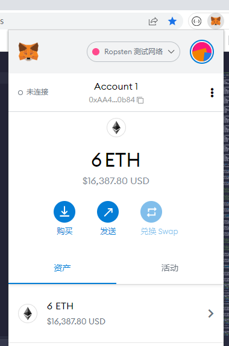
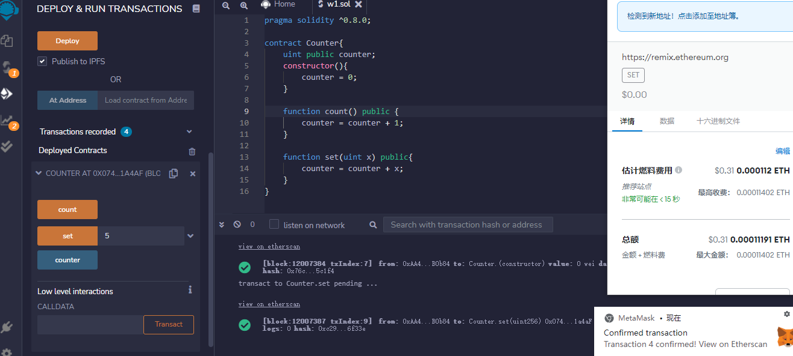
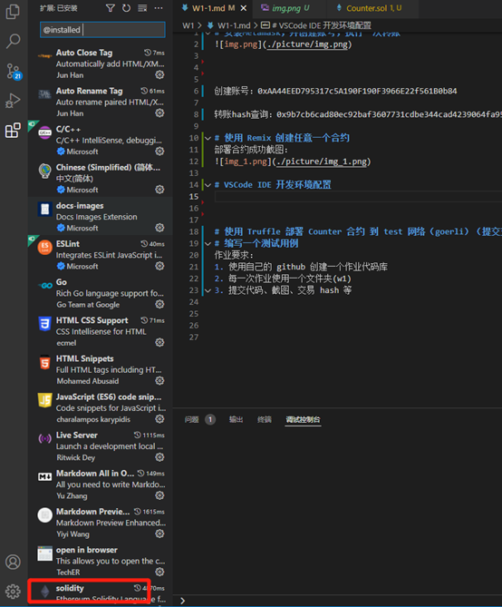

# 安装Metamask，并创建账号，执行一次转账

创建账号：0xAA44EED795317c5A190F190F3966E22f561B0b84

转账hash查询：0x9b7cb6cad80ec92baf3607731cdbe344cad4239064fa95960e6425cbb3fafce2

# 使用 Remix 创建任意一个合约
部署合约成功截图：

# VSCode IDE 开发环境配置

# 使用 Truffle 部署 Counter 合约 到 test 网络（goerli）（提交交易 hash）
交易哈希：
https://ropsten.etherscan.io/tx/0x610cf4ff3b20f7b332492c5887773eeb31839dbf71612db288ac99f2f8fe320e

# 编写一个测试用例
测试用例，在test下的test.js

